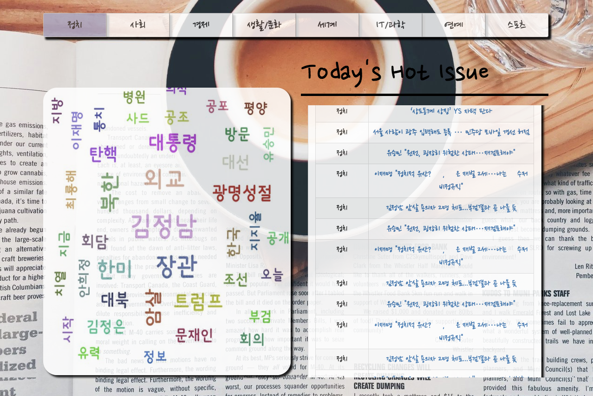
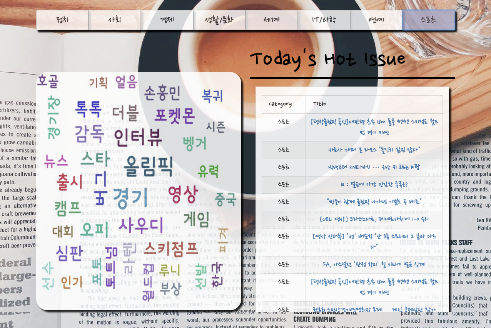

Hot Issue
=============
This Web application shows that the word cloud which consists of the most hot issue keywords in the each field
in the Naver News ( politics, society, economics, life/culture, world, IT/science, entertainment, sports ) and
at the same time, showing that many kinds of news in the each field.

Screen Shot
-------------

Scrapy Setting
=============
Crontab Setting
-------------
1. 터미널에서 EDITOR=vim crontab -e 실행
2. 다음 Code 작성
<pre><codei>
MAILTO = '' // 해당 예약어 수행 결과를 받아보려면 해당 계정이름을 적어줌
PATH=/usr/local/bin
LC_CTYPE="utf-8" // 한글 인코딩 문제
* * * * * * cd crawling folder 절대 경로 && scrapy crawl news ( 크롤링 )
* * * * * * cd crawling folder 절대 경로 && python init.py ( word cloud 생성 )
</code></pre>
3. 완료

Database Setting
-------------
1. databse / createDB.sql 로 데이터 베이스 및 테이블 생성
2. database.php && pipeline.py && makeData.py 에서 환경에 맞게 변수 세팅
3. 완료